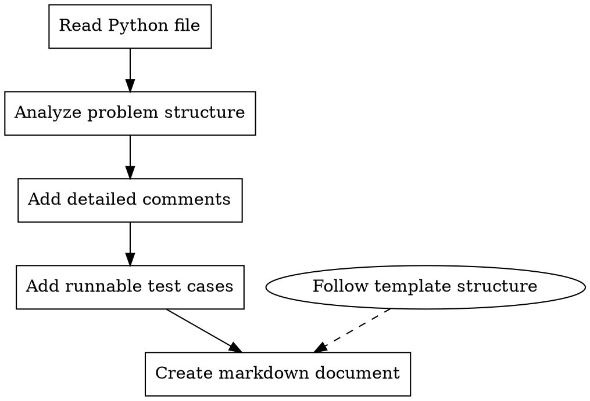

# LeetCode Processor

## Overview

A workflow for processing LeetCode Python solution files to add comprehensive comments, runnable test cases, and generate structured markdown documentation following consistent patterns.

## When to Use

- After solving a LeetCode problem and wanting to document it properly
- When preparing algorithm solutions for code training/review
- Before adding a new problem to a documentation repository
- When standardizing existing LeetCode solutions with consistent formatting

## Core Workflow



## Step-by-Step Process

### 1. Read and Analyze

First, read the Python file to understand:

- Problem ID and title (from comments)
- Current implementation state
- Existing comments or docstrings
- Whether test cases already exist

### 2. Add Comprehensive Comments

**For the solution class/method, add:**

- Problem description summary
- Core algorithm/approach explanation
- Time and space complexity
- Key insights or tricks used

**For complex logic, add inline comments:**

- Why this approach was chosen
- What each variable represents
- Edge cases being handled
- Optimization techniques

**Example structure:**

```python
class Solution:
    """
    [Problem Name] - [Algorithm Type]

    Core idea:
    - Key insight 1
    - Key insight 2

    Why this works:
    [Explanation of correctness]

    Time Complexity: O(...)
    Space Complexity: O(...)
    """
```

### 3. Add Runnable Test Cases

**Standard test structure:**

```python
if __name__ == "__main__":
    sol = Solution()

    tests = [
        # (input1, input2, ..., expected_output),
        (param1, param2, expected),
        # Add more test cases including edge cases
    ]

    for args in tests:
        result = sol.method(*args[:-1])
        expected = args[-1]
        print(f"method({args[:-1]}) = {result}, expected = {expected}")
```

**Include test cases for:**

- Basic examples from problem statement
- Edge cases (empty input, single element, etc.)
- Boundary conditions
- Large input cases (if relevant)

### 4. Create Markdown Documentation
一般的leetcode题解文档位于项目根目录/docs/problems/lc/*.md，建议参考已有文档
**Document structure (follow exactly):**

```markdown
---
title: [Problem Title]
platform: LeetCode
difficulty: [Easy/Medium/Hard]
id: [Problem Number]
url: https://leetcode.cn/problems/[problem-slug]/
tags:
  - [Tag1]
  - [Tag2]
topics:
  - ../../topics/[topic].md
patterns:
  - ../../patterns/[pattern].md
date_added: [YYYY-MM-DD]
date_reviewed: []
---

# [Problem Number]. [Problem Title]

## 题目描述

[Problem description in Chinese]

## 示例

[Example inputs and outputs]

---

## 解题思路

### 第一步：理解问题本质
[Core concept explanation]

### 第二步：暴力解法
[Naive approach with code]

### 第三步：优化解法
[Improved approach]

### 第四步：最优解法
[Optimal solution explanation]

---

## 完整代码实现

```python
[Complete code with comments]
```

---

## 示例推演

[Step-by-step walkthrough with specific numbers]

---

## 复杂度分析

| 解法 | 时间复杂度 | 空间复杂度 | 说明 |
| ---- | ---------- | ---------- | ---- |
| 暴力 | O(...)     | O(...)     | ...  |
| 优化 | O(...)     | O(...)     | ...  |
| 最优 | O(...)     | O(...)     | ...  |

---

## 易错点总结

### 1. [Common mistake 1]

[Explanation and fix]

### 2. [Common mistake 2]

[Explanation and fix]

---

## 扩展思考

[Related problems, variations, deeper insights]

---

## 相关题目

- [Problem Name](URL)

```

## Key Principles

### Preserve Original Code (CRITICAL)
**绝对禁止删除用户原有的代码和注释。**
- 用户亲手写的代码是宝贵的学习记录，必须完整保留
- 可以添加新注释、改进表达、补充说明，但不能删除原有内容
- 可以重构代码结构（如提取函数），但要保留原代码作为注释或备用实现
- 已有的测试用例要保留并补充，不能替换

**正确的做法：**
- 在原有代码基础上添加文档字符串和注释
- 在代码上方或旁边补充更详细的说明
- 为已有的实现添加复杂度分析注释
- 保留所有原有注释，即使表达不够完美

### Progressive Teaching
Always present solutions in order:
1. **Naive/Brute force** - establishes baseline understanding
2. **Optimized approach** - shows how to improve using problem constraints
3. **Optimal solution** - achieves best complexity with detailed explanation

### No Thinking Traces
- Never include phrases like "让我重新推演", "等等", "实际上这个判断有误"
- Present only correct, verified content
- If explanation needs correction, rewrite completely without showing errors

### Beginner-Friendly
- Explain WHY before HOW
- Use analogies and clear explanations
- Show complete step-by-step examples without skipping
- Include boundary conditions and edge cases

### Clean Code
- Use tricks like `±inf` for boundary handling
- Avoid verbose if-else chains for edge cases
- Include type hints where helpful
- Keep code runnable and complete

## LeetCode Submission Requirements

### Class Definition Placement (CRITICAL)
**除 Solution 以外的类（如 TreeNode、ListNode 等）绝对不能放在 `@lc code=start` 和 `@lc code=end` 之间。**

LeetCode 平台会自动提供这些数据结构类的定义，如果在提交代码区域重复定义会导致提交错误。

**正确的文件结构：**
```python
#
# @lc app=leetcode.cn id=xxx lang=python3
# ...

# @lcpr-template-start
from typing import List, Optional


# Definition for a binary tree node.
# TreeNode 定义在这里（模板区域，不会提交到 LeetCode）
class TreeNode:
    def __init__(self, val=0, left=None, right=None):
        self.val = val
        self.left = left
        self.right = right


# @lcpr-template-end
# @lc code=start
# Solution 类必须在这里（提交区域）
class Solution:
    def method(self, root: Optional[TreeNode]) -> ...:
        ...


# @lc code=end

#
# @lcpr case=start
# ...
# @lcpr case=end


# main 代码段必须位于文件最后面
if __name__ == "__main__":
    sol = Solution()
    # 测试代码
```

**常见错误：**
- ❌ 将 `TreeNode`、`ListNode` 等类定义在 `@lc code=start` 和 `@lc code=end` 之间
- ❌ 将 `import` 语句放在 `@lc code=start` 之后（应该放在模板区域）

### Test Code Placement
**`if __name__ == "__main__":` 测试代码段必须位于文件最后面。**

- 测试代码放在所有 LeetCode 注释标记之后
- 确保测试代码不会影响 LeetCode 的提交和执行
- 测试代码可以包含辅助函数（如 build_tree、链表转换等）

## Common Patterns by Problem Type

### Array/Two Pointers
- Explain pointer movement logic
- Show why O(n) is possible vs O(n²)

### Dynamic Programming
- Define dp[i] state clearly
- Show state transition with examples
- Include space optimization techniques

### Backtracking
- Provide backtracking template
- Explain pruning conditions
- Show decision tree visualization

### Graph/BFS/DFS
- Explain traversal order
- Show visited marking strategy
- Include path reconstruction if applicable

### Binary Search
- Explain why monotonicity matters
- Show boundary handling
- Include common variants

### Linked List
- Use dummy node pattern
- Explain pointer manipulation
- Show before/after state

## File Naming Conventions

- Python file: `[id].[problem-name].py` (e.g., `72.edit-distance.py`)
- Markdown file: `[id]_[snake_case_name].md` (e.g., `0072_edit_distance.md`)

## Red Flags - Check Before Finishing

- [ ] **Original code is preserved** - user's handwritten code/comments are not deleted
- [ ] **TreeNode/ListNode 不在提交区域** - 辅助类定义在 `@lcpr-template-start` 和 `@lcpr-template-end` 之间，不在 `@lc code=start` 和 `@lc code=end` 之间
- [ ] **main 测试代码在文件最后** - `if __name__ == "__main__":` 位于文件末尾，在所有 LeetCode 注释之后
- [ ] Comments explain WHY, not just WHAT
- [ ] Test cases include edge cases (original tests preserved + new ones added)
- [ ] Markdown follows exact template structure
- [ ] Complexity analysis uses table format
- [ ] No "thinking traces" in final content
- [ ] Code is runnable with `python filename.py`
- [ ] Progressive approach (naive → optimal) is shown
```
