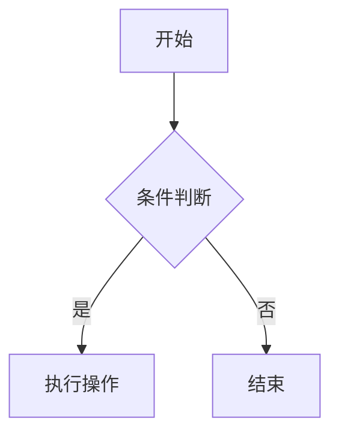

# Code Training - 算法训练仓库

长期算法训练知识库，面向系统化学习和持续积累。

## 📚 项目简介

这是一个**以知识体系为核心**的算法训练仓库，采用**数据库思维**而非平台思维进行组织。

### 核心特点

- ✅ **原子化存储**：每道题目独立存档，便于检索和维护
- ✅ **知识聚合**：按知识点和算法模式组织，而非按平台分类
- ✅ **双向链接**：题目 ↔ 知识点 ↔ 模式，形成知识网络
- ✅ **YAML 元数据**：结构化信息，支持筛选和统计
- ✅ **持续积累**：错题本、周总结，强化复习体系

### 设计理念

> **数据库思维，不是平台思维**

- 题目是原子单位（problems/）
- 知识点是聚合层（topics/）
- 模式是抽象层（patterns/）
- 模板是工具层（templates/）
- 复习是反馈层（review/）

## 📂 目录结构

```
code-training/
│
├── docs/                  # ✅ 站点内容
│   ├── problems/          # ✅ 题目存档（原子层）
│   ├── lc/               # LeetCode 题目
│   │   └── 0001_two_sum.md
│   ├── nc/               # 牛客题目
│   └── misc/             # 其他平台题目
│
│   ├── topics/            # ✅ 知识点聚合
│   ├── array.md          # 数组
│   ├── hash_table.md     # 哈希表
│   ├── tree.md           # 树
│   ├── binary_tree.md    # 二叉树
│   └── sorting.md        # 排序
│
│   ├── patterns/          # 🎯 算法模式
│   ├── two_pointers.md   # 双指针
│   ├── sliding_window.md # 滑动窗口
│   ├── bfs.md            # 广度优先搜索
│   ├── dfs.md            # 深度优先搜索
│   └── hash_map.md       # 哈希映射
│
│   ├── templates/         # 🛠️ 代码模板
│   ├── bfs_template.md
│   ├── dfs_template.md
│   └── binary_search_template.md
│
│   └── review/            # 📝 复习系统
│       ├── wrong_questions.md    # 错题本
│       └── weekly_summary.md     # 周总结
│
└── README.md              # 仓库说明
```

## 🚀 快速开始

### 1. 添加新题目

在 `problems/平台/` 下创建新文件，格式：`题号_题目名.md`

```yaml
---
title: 题目名称
platform: LeetCode
difficulty: 简单/中等/困难
id: 题号
url: 题目链接
tags: [标签1, 标签2]
topics:
  - ../../topics/知识点.md
patterns:
  - ../../patterns/模式.md
date_added: YYYY-MM-DD
date_reviewed: []
---

# 题号. 题目名称

## 题目描述
...

## 解题思路
...

## 代码实现
...

## 相关题目
...
```

### 2. 学习知识点

浏览 `topics/` 目录，每个知识点包含：
- 核心概念
- 常见题型
- 解题技巧
- 相关题目列表

### 3. 掌握算法模式

查看 `patterns/` 目录，学习通用解题模式：
- 适用场景
- 模板代码
- 实战案例
- 练习题目

### 4. 使用代码模板

`templates/` 提供常用算法的标准实现，可直接复制使用。

### 5. 记录和复习

- **错题本**：`review/wrong_questions.md` - 记录错题和易错点
- **周总结**：`review/weekly_summary.md` - 每周学习总结

## 🎯 使用原则

### ✅ 推荐做法

- 一题多解，记录不同解法
- 建立知识点之间的关联
- 定期复习错题和总结
- 使用相对路径链接形成知识网络

### ❌ 禁止做法

- 按平台分类做主结构
- 将题目文件放入知识点目录
- 扁平化堆叠所有题目
- 复制粘贴代码不加理解

## 📈 统计信息

### 题目统计

- **总题数**：3
- **LeetCode**：3
- **牛客**：0
- **其他**：0

### 难度分布

- **简单**：1
- **中等**：2
- **困难**：0

### 知识点覆盖

- 数组 ✅
- 哈希表 ✅
- 树 ✅
- 二叉树 ✅
- 排序 ✅

## 🔗 相关资源

- [LeetCode](https://leetcode.cn/)
- [牛客网](https://www.nowcoder.com/)
- [代码随想录](https://programmercarl.com/)
- [LeetCode 101](https://github.com/changgyhub/leetcode_101)

## 📝 维护日志

- **2026-02-25**：项目初始化
  - 创建 problems、topics、patterns、templates、review 目录
  - 添加示例题目和知识点文件
  - 配置 Docusaurus 和 GitHub Pages 部署
  - 创建 GitHub Actions 自动部署工作流

## 🌐 在线访问

本项目使用 Docusaurus 构建，并部署在 GitHub Pages：

**网站地址**: https://www.hanphone.top/code-training/

## 💻 本地开发

### 安装依赖

```bash
pnpm install
```

### 启动开发服务器

```bash
pnpm start
```

访问 http://localhost:3001

### 构建生产版本

```bash
pnpm build
```

### 预览构建结果

```bash
pnpm serve
```

### 部署前检查

```bash
# Windows
.\scripts\check-deploy.ps1

# Linux/Mac
bash scripts/check-deploy.sh
```

## 🚀 部署到 GitHub Pages

项目已配置自动部署，只需：

```bash
git add .
git commit -m "feat: 添加新内容"
git push origin main
```

GitHub Actions 会自动构建并部署到 GitHub Pages。

**详细部署指南**: 查看 [DEPLOYMENT.md](DEPLOYMENT.md)

## 📁 项目结构

```
code-training/
├── .github/
│   └── workflows/
│       ├── deploy.yml          # 自动部署工作流
│       └── test-build.yml      # PR 构建测试
├── docs/                       # Docusaurus 文档源文件
│   └── intro.md               # 文档首页
├── problems/                   # 题目存档
├── topics/                     # 知识点
├── patterns/                   # 算法模式
├── templates/                  # 代码模板
├── review/                     # 复习系统
├── scripts/                    # 辅助脚本
│   ├── check-deploy.ps1       # 部署前检查（Windows）
│   └── check-deploy.sh        # 部署前检查（Unix）
├── src/                        # Docusaurus 源码
│   ├── css/                   # 样式文件
│   └── pages/                 # 自定义页面
├── static/                     # 静态资源
│   ├── .nojekyll             # GitHub Pages 配置
│   └── img/                  # 图片资源
├── docusaurus.config.ts       # Docusaurus 配置
├── sidebars.ts                # 侧边栏配置
├── package.json               # 项目依赖
├── DEPLOYMENT.md              # 部署指南
└── README.md                  # 本文件
```

## 🛠️ 技术栈

- **框架**: [Docusaurus 3](https://docusaurus.io/)
- **UI**: [React 19](https://react.dev/)
- **语言**: [TypeScript](https://www.typescriptlang.org/)
- **包管理**: [pnpm](https://pnpm.io/)
- **部署**: GitHub Pages + GitHub Actions
- **搜索**: @easyops-cn/docusaurus-search-local
- **图表**: Mermaid

## ⚙️ 配置说明

### 修改站点信息

编辑 `docusaurus.config.ts`:

```typescript
{
  title: 'Code Training - 算法训练',
  tagline: '系统化算法学习与知识积累',
  url: 'https://www.hanphone.top',
  baseUrl: '/code-training/',
}
```

### 自定义导航栏

编辑 `docusaurus.config.ts` 中的 `navbar` 配置。

### 修改侧边栏结构

编辑 `sidebars.ts` 自定义侧边栏分类和顺序。

## 🔧 常用命令

```bash
# 开发
pnpm start                 # 启动开发服务器
pnpm build                 # 构建生产版本
pnpm serve                 # 预览构建结果
pnpm clear                 # 清理缓存

# 类型检查
pnpm typecheck            # 运行 TypeScript 类型检查

# 部署
pnpm deploy               # 手动部署到 GitHub Pages
```

## 📚 相关文档

- [部署指南](DEPLOYMENT.md) - 详细的部署说明
- [Git 提交规范](https://github.com/hanphonejan/code-training/blob/main/.github/GIT_COMMIT_GUIDE.md) - 提交信息格式
- [Docusaurus 文档](https://docusaurus.io/) - 官方文档

## 🤝 贡献指南

这是个人学习仓库，欢迎借鉴和参考。如有建议，欢迎提 Issue。

### 提交规范

遵循 [Conventional Commits](https://www.conventionalcommits.org/)：

```bash
feat(problems): 添加两数之和题目
fix(topics): 修复数组知识点的链接
docs(readme): 更新部署说明
chore(config): 更新 Docusaurus 配置
```

详见 [Git 提交指南](https://github.com/hanphonejan/code-training/blob/main/.github/GIT_COMMIT_GUIDE.md)

## 📄 许可证

MIT License

---

**开始你的算法之旅吧！** 🚀

1. 在 `docs/` 目录下创建 `.md` 文件（推荐使用 Markdown 而非 MDX）
2. 在文件开头添加 Front Matter：

```markdown
---
sidebar_position: 1
title: 文档标题
---

# 文档标题

文档内容...
```

**示例：**

```bash
# 创建新文档
docs/
├── 前端/
│   └── React基础.md
├── 后端/
│   └── Node.js入门.md
└── intro.md
```

### 添加博客（Blog）

1. 在 `blog/` 目录下创建 `.md` 文件
2. 文件名格式：`YYYY-MM-DD-标题.md`（日期可选）
3. 添加 Front Matter：

```markdown
---
title: 博客标题
authors: hanphonejan
tags: [react, 前端]
date: 2024-01-15
---

博客内容...
```

**示例：**

```bash
# 创建新博客
blog/
├── 2024-01-15-react-hooks-guide.md
├── 2024-02-20-typescript-tips.md
└── authors.yml
```

**配置作者信息：**

编辑 `blog/authors.yml`：

```yaml
hanphonejan:
  name: HanphoneJan
  title: 前后端工程师
  url: https://github.com/hanphonejan
  image_url: https://github.com/hanphonejan.png
```

### 组织文档结构

使用文件夹来组织文档分类：

```
docs/
├── 前端/           # 前端相关文档
├── 后端/           # 后端相关文档
├── 数据库/         # 数据库相关文档
└── intro.md       # 首页文档
```

Docusaurus 会自动根据文件夹结构生成侧边栏。

### 修改文档

直接编辑 `docs/` 或 `blog/` 目录下的 `.md` 文件即可。保存后：
- 开发模式下会自动刷新
- 推送到 GitHub 后会自动重新部署

### 删除文档

直接删除 `docs/` 或 `blog/` 目录下的 `.md` 文件即可。

### Front Matter 常用配置

**Docs 文档：**

```markdown
---
sidebar_position: 1        # 侧边栏排序（数字越小越靠前）
title: 自定义标题          # 页面标题
sidebar_label: 侧边栏标签  # 侧边栏显示的文字
---
```

**Blog 博客：**

```markdown
---
title: 博客标题
authors: hanphonejan      # 作者（在 authors.yml 中定义）
tags: [react, 前端]       # 标签
date: 2024-01-15          # 发布日期
---
```

### Markdown 语法支持

支持标准 Markdown 语法，包括：

- 标题：`# ## ### ####`
- 列表：`- * 1.`
- 代码块：` ```语言 `
- 链接：`[文字](链接)`
- 图片：``
- 表格
- 引用：`>`
- 粗体：`**文字**`
- 斜体：`*文字*`

**代码块示例：**

````markdown
```javascript
function hello() {
  console.log('Hello, World!');
}
```
````

**Mermaid 图表示例：**

````markdown

````

### 添加图片

1. 将图片放到 `static/img/` 目录
2. 在文档中引用：

```markdown

```

## 📦 技术栈

- [Docusaurus 3](https://docusaurus.io/) - 现代化静态网站生成器
- [React 19](https://react.dev/) - UI 框架
- [TypeScript](https://www.typescriptlang.org/) - 类型安全
- [Mermaid](https://mermaid.js.org/) - 图表支持
- [pnpm](https://pnpm.io/) - 包管理器

## 🎨 设计特点

- 科技蓝配色方案（#0066FF）
- 深色模式优先
- Inter + JetBrains Mono 字体
- 极简工程美学设计
- 完整的响应式支持

## 🚀 部署

项目配置了 GitHub Actions 自动部署。推送到 `main` 分支后会自动构建并部署到 GitHub Pages。

**部署步骤：**

1. 推送代码到 GitHub：
```bash
git add .
git commit -m "更新文档"
git push origin main
```

2. 在 GitHub 仓库设置中启用 GitHub Pages：
   - 进入 Settings > Pages
   - Source 选择 "GitHub Actions"

3. 访问：https://hanphonejan.github.io

## 📁 项目结构

```
.
├── blog/                   # 博客文章（时间序列）
│   ├── 2024-01-15-xxx.md
│   └── authors.yml        # 作者信息配置
├── docs/                   # 文档目录（层级结构）- 主要编辑这里
│   ├── 前端/
│   ├── 后端/
│   └── intro.md
├── src/
│   ├── components/        # React 组件
│   ├── css/              # 样式文件
│   └── pages/            # 自定义页面
├── static/               # 静态资源（图片等）
│   └── img/
├── .github/
│   └── workflows/        # GitHub Actions 自动部署
├── docusaurus.config.ts  # 主配置文件
└── package.json
```

> **说明**：`sidebars.ts` 不是必需的。Docusaurus 会根据 `docs/` 文件夹结构**自动生成**侧边栏，每个文件夹成为分类，每个 `.md` 文件成为链接。仅当需要自定义侧边栏顺序或结构时才需要创建该文件。

**目录说明：**

- `docs/` - 技术文档，支持层级结构和侧边栏导航
- `blog/` - 博客文章，按时间排序，支持标签和作者
- `static/` - 静态资源，如图片、文件等
- `src/` - 源代码，包括自定义组件和页面

## ⚙️ 配置说明

### 修改网站标题

编辑 `docusaurus.config.ts`：

```typescript
const config: Config = {
  title: 'HanphoneJan 技术文档',  // 修改这里
  tagline: '技术文档与知识分享',   // 修改这里
  // ...
};
```

### 修改顶部导航栏

顶部导航栏在 `docusaurus.config.ts` 的 `themeConfig.navbar` 中配置，可自定义 Logo、链接、下拉菜单等。文档与博客入口会根据 `docs/` 和 `blog/` 的存在自动展示。

### 修改页脚

编辑 `docusaurus.config.ts` 中的 `footer` 配置。

## 🔧 常见问题

### 1. 文档没有显示在侧边栏

确保文档文件：
- 在 `docs/` 目录下
- 是 `.md` 文件
- 包含正确的 Front Matter

### 2. 博客文章没有显示

确保博客文件：
- 在 `blog/` 目录下
- 文件名格式正确（可选日期前缀）
- 包含 Front Matter（至少有 title）

### 3. 图片无法显示

- 图片应放在 `static/img/` 目录
- 引用路径以 `/` 开头：`/img/xxx.png`

### 4. 代码高亮不正确

在代码块后指定语言：

````markdown
```javascript
// 代码
```
````

支持的语言：`javascript`, `typescript`, `python`, `java`, `go`, `rust`, `sql`, `bash`, `json` 等

### 5. 如何禁用博客功能

如果只需要文档功能，可以：

1. 删除 `blog/` 目录
2. 编辑 `docusaurus.config.ts`，移除导航栏中的博客链接：

```typescript
navbar: {
  items: [
    // 删除或注释这一行
    // {to: '/blog', label: '博客', position: 'left'},
  ],
}
```

### 6. 如何修改侧边栏结构

Docusaurus **默认根据 `docs/` 目录结构自动生成侧边栏**，无需配置。每个文件夹成为分类，每个 `.md` 文件成为链接。通过文档的 Front Matter 控制顺序和标签：

- `sidebar_position`：控制排序（数字越小越靠前）
- `sidebar_label`：自定义侧边栏显示文字
- `_category_.json`：在文件夹内添加，可自定义分类标签和顺序

仅当需要完全自定义侧边栏（如手动指定顺序、添加外部链接）时，才需创建 `sidebars.ts` 并配置 `sidebarPath`。

## 📄 许可证

Copyright © 2026 HanphoneJan

---

## 📖 快速参考

### 常用命令

```bash
# 开发
pnpm start              # 启动开发服务器
pnpm build              # 构建生产版本
pnpm serve              # 预览构建结果
pnpm clear              # 清理缓存

# 部署
git add .
git commit -m "更新内容"
git push origin main    # 推送后自动部署
```

### 文件命名规范

**Docs 文档：**
- ✅ `React基础.md`
- ✅ `Node.js入门.md`
- ✅ `API参考.md`

**Blog 博客：**
- ✅ `2024-01-15-react-hooks.md`（推荐）
- ✅ `react-hooks.md`（也可以）

### Markdown 快速语法

```markdown
# 一级标题
## 二级标题
### 三级标题

**粗体** *斜体* `代码`

- 无序列表
1. 有序列表

[链接文字](https://example.com)


> 引用文字

| 表头1 | 表头2 |
|-------|-------|
| 内容1 | 内容2 |
```

### 代码块示例

````markdown
```javascript
function hello() {
  console.log('Hello, World!');
}
```
````

### Mermaid 图表示例

````markdown

````

### 有用的链接

- [Docusaurus 官方文档](https://docusaurus.io/)
- [Markdown 语法指南](https://www.markdownguide.org/)
- [Mermaid 图表文档](https://mermaid.js.org/)
- [GitHub Pages 文档](https://docs.github.com/pages)
